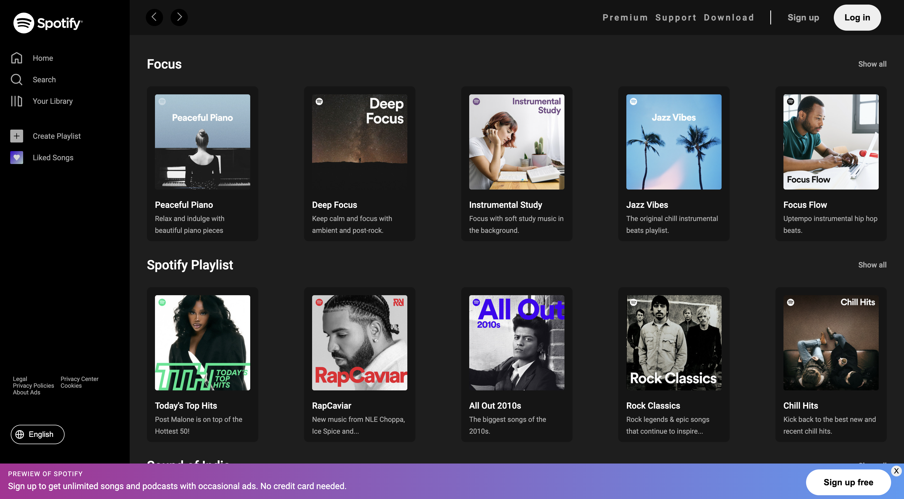

# Spotify Web Player Clone 🎵  

Welcome to the Spotify Web Player Clone! This project is a tribute to the sleek design and functionality of Spotify, recreated using modern web technologies. Dive into a responsive and interactive music experience that you can customize and extend.

 <!-- Add a screenshot of your project here -->

## 🚀 Features  
- **Responsive Design**: Ensures a seamless experience across all device types.
- **Custom Navigation**: Navigate through Home, Search, Your Library, and other essential sections with ease.
- **Interactive UI**: Enhance user interaction with:
  - Navigation arrows for browsing content.
  - Quick access buttons for Premium, Support, and Download services.
  - Authentication buttons for Sign Up and Log In.
  - Music management with Create Playlist and Liked Songs.
- **Footer Bar**: Includes play controls and can be customized to show additional information.

## 🛠️ Technologies Used  
  
  
  

## 🖼️ Project Structure  

```
/project-folder  
├── /css  
│   ├── responsive.css  
│   ├── header.css  
│   ├── body.css  
│   ├── sidebar.css  
│   ├── bottombar.css  
│   ├── content.css  
│   └── additional-info.css  
├── index.html  
└── /assets  
    └── (optional images or SVG files)  
```

## 🔧 Setup and Usage  
To get started with this project, follow these simple steps:

1. **Clone the Repository**
   ```bash  
   git clone <repository-url>
   cd project-folder  
   ```
2. **Open the Project**
   - Launch `index.html` in your favorite web browser to see the clone in action.
3. **Customize**
   - Feel free to modify the CSS files within the `css/` directory to tailor the styles to your preferences.

Enjoy building and customizing your version of the Spotify Web Player!
